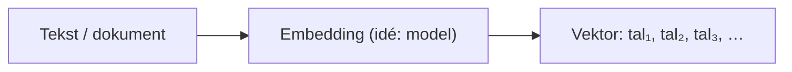
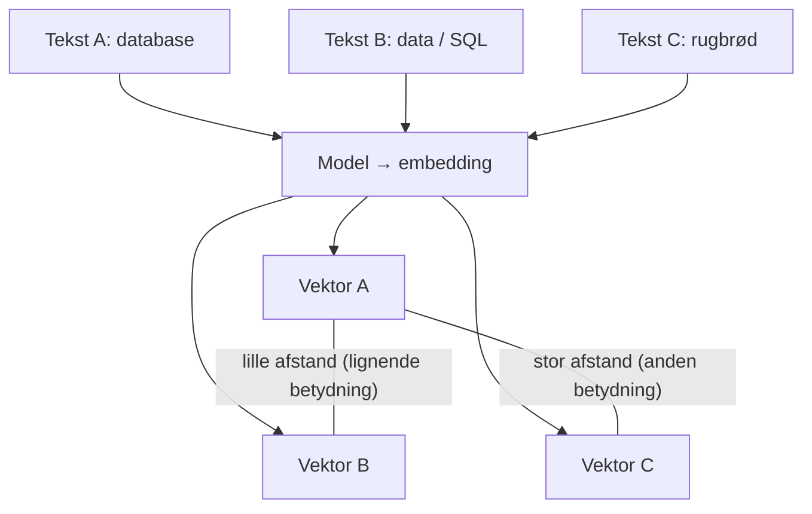

## `pgvector`: vektorer og “semantisk” søgning

`pgvector` tilføjer en `vector` datatype og indeksmuligheder til nærmeste-nabo søgning (k-NN).

---

### Hvad er en vektor (helt konkret)?

En **vektor** er bare en **liste af tal** med en fast længde, fx tre tal:

`[0.9, 0.1, 0.1]`

Du kan forestille dig hvert tal som en **koordinat på en akse**:

- 1. tal → “hvor meget retning A”
- 2. tal → “hvor meget retning B”
- 3. tal → “hvor meget retning C”

I demoen bruger vi **3 dimensioner**, så du kan tegne det som et punkt i et **3D-rum**. I virkelighedens produktion er der ofte **hundreder eller tusindvis** af dimensioner — samme idé, bare umuligt at tegne.



**Pointe:** En embedding er “adressen” på et stykke indhold i et høj-dimensionelt rum.

---

### Hvorfor kan man tale om “afstand” mellem ord?

Ord er ikke tal — men en **embedding-model** (fx fra sprog-/multimodal AI) har lært at **mappe tekst til tal**, så statistik og geometri kan bruges.

Intuition:

- Modellen har set **massivt** med tekst og lært: visse ord og sætninger **hører sammen** i betydning.
- Den koder den slags sammenhæng som: **lignende betydning → punkter der ligger tæt** i vektor-rummet.
- **Afstand** mellem to vektorer er så et mål for “hvor forskellige” to tekster er i *mening*, ikke i stavemåde.



Så “afstand i ord” betyder egentlig: **afstand mellem de vektorer, som repræsenterer teksternes betydning** — ikke afstand mellem bogstaver.

---

### 2D-intuition (som i matematik)

I 2D kender du afstand mellem to punkter — samme tanke i 3D eller 384D:

- Tæt på hinanden → **lignende** indhold (efter modellens læring).
- Langt fra hinanden → **forskelligt** indhold.

Her er et **skelet** af idéen (akserne er “abstrakte”; i demoen er det 3 tal):

```text
        ↑ akse 2 (fx “geografi-tema”)
        |
   Geodata ●
        |        ● Søgning
        |    ● Postgres
        +--------------------→ akse 1 (fx “database-tema”)
```

I vores **rigtige demo** ligger de tre dokumenter som faste 3D-punkter; din **query-vektor** er et nyt punkt — den tekst/række der ligger **tættest** er “mest semantisk lig” i den simple model vi har bygget til øvelsen.

---

### Hvad er en embedding (igen, kort)?

En **embedding** er den vektor, en model har valgt for et stykke tekst (eller billede, lyd, …). I produktion kommer den fra en trænet model. Her bruger vi **små, håndplukkede 3D-vektorer**, så du kan se **k-NN og `<->`** uden at køre et neuralt net først.

---

### Distance-mål (hvad måler `<->`?)

`pgvector` understøtter flere mål, typisk:

- **L2 (euclidisk)** — “som målebånd i rummet” mellem to punkter
- **cosine** — mere fokus på *retning* end længde af vektoren
- **inner product** — bruges særligt når modellen er trænet til det

I demoen bruges L2 med operatoren:

- `embedding <-> query_vector`  
  **Lav værdi** → tættere på i rum → **mere “lig”** i den simple demo.

---

### Indeks: `ivfflat`

`ivfflat` er et **approximativt** indeks: det finder hurtigt *næsten* de nærmeste naboer.

- Kan i sjældne tilfælde overse den absolut bedste match (tradeoff: fart vs. præcision).
- På små datasæt er indekset mest til at vise **hvordan** man gør i produktion.

---

### Demo i dette repo

Init-scriptet `docker/initdb/60-pgvector-demo.sql`:

- opretter `documents` med en `vector(3)`
- indsætter 3 demo dokumenter med tydeligt forskellige “retninger” i rummet
- laver et `ivfflat` indeks
- kører en nearest-neighbor query med en query-vektor tæt på “Postgres”-dokumentet

I **web-appen** får du ofte et **søjlediagram** over afstande — det er den samme idé som “afstand i rummet”, bare læst som tal.

### Øvelser

- Tilføj flere rækker og prøv forskellige query-vektorer — hvilken tekst ender tættest på, og hvorfor?
- Diskutér: hvornår er **bogstav-lighed** (`LIKE`) bedre end **semantisk nærhed** (vektor)?
- Slå op på cosine vs. L2 og forklar med egne ord, hvornår retning vs. længde betyder mest.
